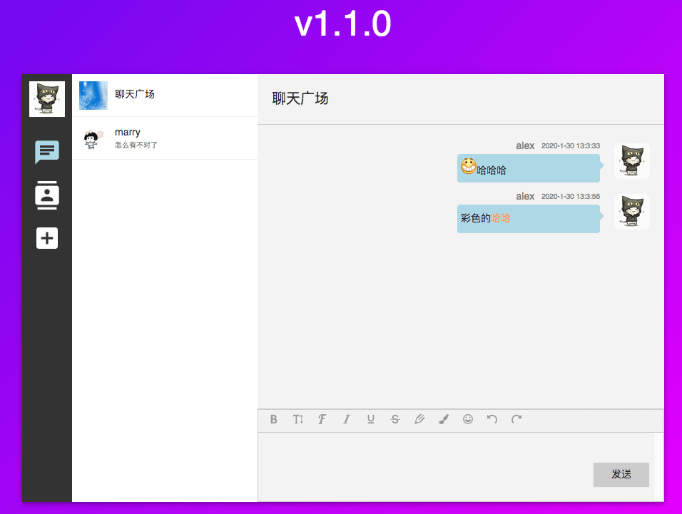
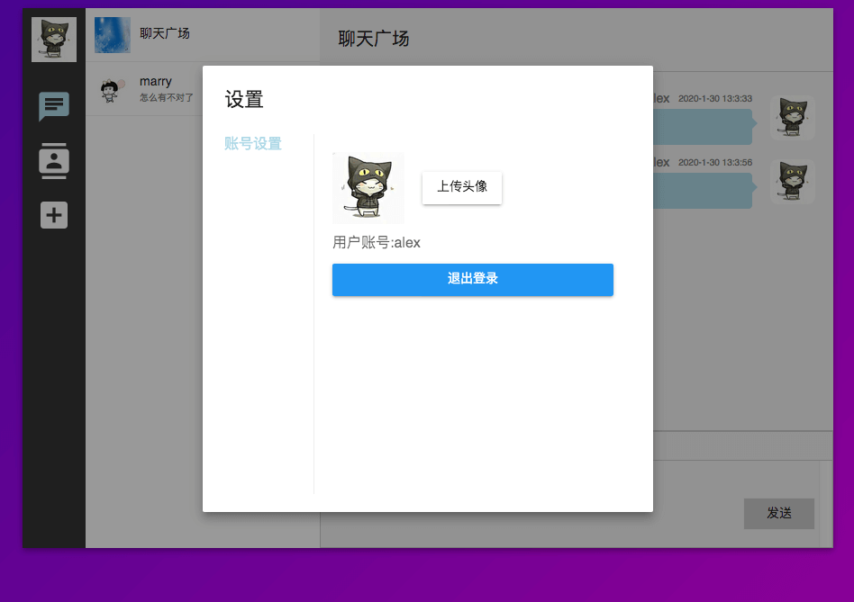

## 项目介绍


这是一个用于学习node 所写的仿网页微信的即时聊天的<span style='color:red'>客户端</span><br>
项目是用vue + socket-io写的。

demo地址 http://47.105.210.34:8086

服务端仓库地址 https://github.com/Magic-zhu/chatroom_server





###### 安装依赖

```bash
npm install
```
###### 启动项目

```bash
npm start
```
###### 打包&&构建

注意在vue.config.js中修改 服务器路径
```bash
npm run build
```

### 功能点

* 聊天广场 
* 点对点聊天 
* 好友功能
* 处理离线消息
* 聊天记录本地存储
* 富文本聊天 `v1.1.0+`
* 修改/上传头像 `v1.1.0+`
* 聊天表情emoji `v1.1.0+`

#### ToDoList

* 上传聊天记录
* 好友系统重做 - 支持分组
* 群功能

 
